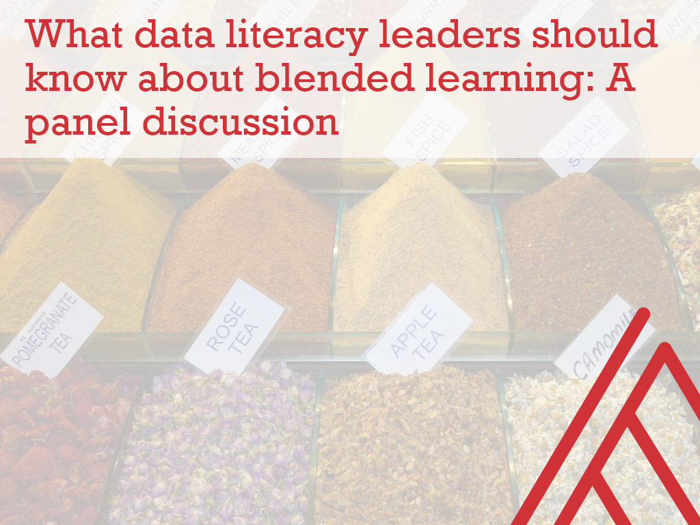

# Resources for panel discussion on blended learning

Thanks for your interest in participating in this panel. I will be in touch with next steps on scheduling and other logistics. There will eventually be a blog post, Eventbrite page and so forth to publicize the event. 

In the meantime, you can review the proposed questions in the Word doc here. They will be shared with participants as part of the slide deck during the event, the draft of which is also available in this repo.  

I am looking forward to the program and a special thanks for Shilpam for coordinating all the panelists and more!
